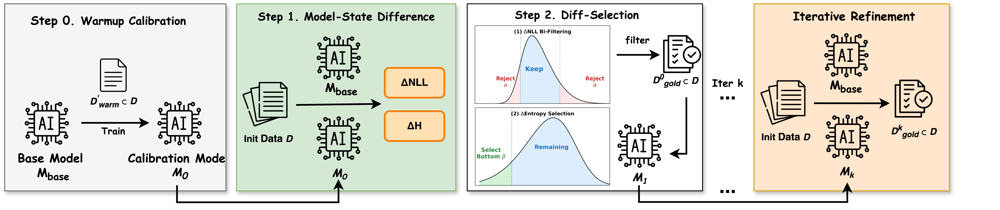

# InstructDiff: Domain-Adaptive Data Selection via Differential Entropy

<div align="center">

[](instructdiff_preprint.pdf)
[](LICENSE)
[](https://www.python.org/downloads/)
[](https://github.com/psf/black)

**[Overview](#overview) | [Installation](#installation) | [Quick Start](#quick-start) | [Methodology](#methodology) | [Results](#experimental-results) | [Citation](#citation)**

</div>

---

## 📋 Abstract

**InstructDiff** is a model-aware, domain-adaptive data selection framework for efficient supervised fine-tuning (SFT) of large language models. By measuring distributional shifts between a base model and a lightly calibrated variant, InstructDiff identifies samples at the model's "learnable frontier" through differential entropy analysis. Our method achieves superior performance across diverse domains while using only 10-20% of training data, demonstrating consistent improvements over full-dataset training and existing selection methods.

### Key Features

- 🎯 **Domain-Adaptive**: Single criterion adapts across reasoning, medical, coding, and general instruction-following tasks
- 🚀 **Data-Efficient**: Achieves +17% to +52% relative gains over full training with 10-20% data
- 🔧 **Model-Agnostic**: Works across different model families and scales
- 📊 **Theoretically Grounded**: Based on differential entropy and information theory principles
- 🔄 **Iterative Refinement**: Optional multi-round selection for additional performance gains

---

## 📊 Overview

<p align="center">
  
  <br>
  <em>Figure 1: InstructDiff pipeline with warmup calibration, bi-directional NLL filtering, and differential entropy ranking.</em>
</p>

InstructDiff addresses the challenge of efficient fine-tuning by identifying high-value training samples through three key components:

1. **Warmup Calibration**: Establishes an instruction-aware reference model via lightweight fine-tuning
2. **Bi-Directional NLL Filtering**: Removes redundant (too easy) and incomprehensible (too hard) samples
3. **Differential Entropy Ranking**: Selects domain-adaptive samples based on distributional shift magnitude

---

## Quickstart

Install:

```bash
pip install -e .
```

Sample and train (medical example):

```bash
# sample 100 from first 1k
instdiff sample --config configs/med/sample_med_1k_100.yaml

# train on 100 samples
instdiff train --config configs/med/train_med_100.yaml

# run iterative pipeline (2 rounds)
instdiff pipeline --config configs/med/pipeline_med_iter.yaml
instdiff pipeline --config configs/med/pipeline_med_iter2.yaml
```

Outputs are written under `runs/`.

---

## 🧪 Methodology

**Stage 1 - Warmup Calibration**
- Fine-tune the base model on a small random subset.
- Use the calibrated model as a reference for distributional measurements.

**Stage 2 - Distribution-Aware Selection**
- Compute per-sample delta NLL and delta entropy between base and calibrated models.
- Apply bi-directional NLL filtering to retain the learnable middle range.
- Rank the remaining samples by delta entropy and select the lowest values.

**Iterative Refinement (optional)**
- Repeat selection using the newly fine-tuned model as the next calibration reference.

---

## 📈 Experimental Results

### Main Results

Performance comparison across four domains with 10% data selection (20% for code). Results demonstrate InstructDiff's consistent superiority over baselines.

| Method | Math (Avg) | General (Avg) | Medical (Avg) | Code (Avg) |
|:-------|:----------:|:-------------:|:-------------:|:----------:|
| Base Model | 12.61 | 0.81 | 47.87 | 39.6 |
| Full Training (100%) | 27.05 | 4.93 | 53.14 | 43.0 |
| Random Sampling | 25.80 | 3.81 | 46.76 | 40.8 |
| IFD | 21.99 | 6.52 | 44.59 | 37.1 |
| SelectIT | 24.35 | 5.09 | 42.96 | 44.4 |
| ZIP | 22.61 | 3.84 | 54.41 | 39.4 |
| Superfiltering | 25.31 | 7.35 | 38.29 | 39.4 |
| **InstructDiff (Ours)** | **31.63** | **7.47** | **56.42** | **45.1** |
| *Relative Gain vs. Full* | ***+17%*** | ***+52%*** | ***+6.2%*** | ***+4.9%*** |

**Key Findings**:
- InstructDiff is the **only method** that consistently outperforms full-data training across all domains
- Achieves superior results with **10-20% of training data** (90% reduction in training cost)
- Demonstrates robust performance across diverse model families (Qwen, LLaMA) and task types

**Detailed benchmark breakdown**: See original paper for per-benchmark results including AIME24 (7.71), Math-OAI (61.79), AlpacaEval (12.09%), HumanEval (48.2), MedQA (54.67), and more.

---

## 🔬 Analysis and Findings

**Bi-Directional NLL Filtering**: Essential component; removing it causes -2.59 to -5.56 performance drops across domains.

**Warmup Size**: 10% warmup ratio provides optimal balance (31.63 avg on math); smaller ratios lack calibration, larger ones reduce selection pool.

**Scaling**: Maintains effectiveness on large pools (100k samples); outperforms baselines consistently.

**Cross-Model Transfer**: High overlap within model families (64% recall Qwen2.5-7B ↔ 14B); low across families (~15%). Same-family calibration performs best.

**Weak-to-Strong**: Small models (0.5B, 1.5B) can guide selection for larger models with +10% gains, though self-calibration remains optimal.

**Iterative Refinement**: Yields +4.0% (round 2) and +1.1% (round 3) improvements; 2-3 rounds recommended for best results.

---

## 📁 Repo Structure

```
Data-Selection/
│
├── ⚙️  configs/                     # Experiment configurations
│   ├── math/                       # Mathematical reasoning setup
│   ├── med/                        # Medical domain setup
│   ├── code/                       # Code generation setup
│   └── general/                    # General instruction-following setup
│
├── 💾 data/                        # Datasets and data processing
│
├── 🧪 eval/                        # Evaluation benchmarks and scripts
│
├── 📊 figs/                        # Figures and visualizations
│
├── 🔧 src/                         # Core implementation
│   ├── instdiff/                   # Main pipeline (CLI, sampling, training)
│   └── instdiff_tools/             # Analysis and plotting utilities
│
├── 📋 requirements.txt             # Python dependencies
├── ⚙️  setup.py                     # Package installation script
└── 📖 README.md                    # This file
```

---

## 🤝 Contributing

We welcome contributions from the community! Please follow these guidelines:

1. **Fork** the repository
2. **Create** a feature branch (`git checkout -b feature/AmazingFeature`)
3. **Commit** your changes (`git commit -m 'Add some AmazingFeature'`)
4. **Push** to the branch (`git push origin feature/AmazingFeature`)
5. **Open** a Pull Request

Please ensure your code follows:
- PEP 8 style guidelines
- Comprehensive docstrings
- Unit tests for new features

---

## 📄 License

This project is licensed under the MIT License - see the [LICENSE](LICENSE) file for details.

---

## 👥 Authors

**Junyou Su**$^{1*}$, **He Zhu**$^{1*†}$, **Xiao Luo**$^{2}$, **Liyu Zhang**$^{1}$, **Hong-Yu Zhou**$^{3}$, **Yun Chen**$^{4}$, **Peng Li**$^{3}$, **Yang Liu**$^{3}$, **Guanhua Chen**$^{5†}$

<sup>1</sup>Peking University  
<sup>2</sup>University of Wisconsin-Madison  
<sup>3</sup>Tsinghua University  
<sup>4</sup>Shanghai University of Finance and Economics  
<sup>5</sup>Southern University of Science and Technology

<sup>*</sup>Equal contribution  
<sup>†</sup>Corresponding authors

---

## 📝 Citation

If you find this work useful in your research, please consider citing:

```bibtex
@inproceedings{su2026instructdiff,
  title={InstructDiff: Domain-Adaptive Data Selection via Differential Entropy for Efficient {LLM} Fine-Tuning},
  author={Su, Junyou and Zhu, He and Luo, Xiao and Zhang, Liyu and Zhou, Hong-Yu and Chen, Yun and Li, Peng and Liu, Yang and Chen, Guanhua},
  booktitle={Proceedings of the 64th Annual Meeting of the Association for Computational Linguistics (ACL)},
  year={2026},
  organization={Association for Computational Linguistics}
}
```

---

<div align="center">

**⭐ Star us on GitHub if you find this project helpful! ⭐**

</div>
